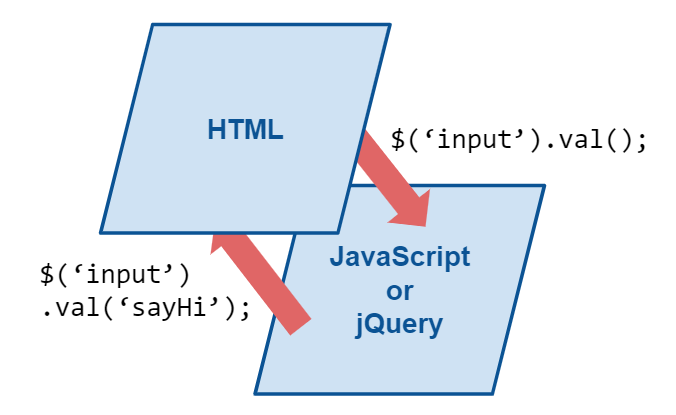

# Angular - 3 - Data Binding 1
一般我們在控制前端畫面時，都是使用原生 js 或是 jQuery 來操作畫面。想要取得畫面上的值會先抓取相對應的 DOM 元素，使用 value 或是 innerHTML 來取得；如果是放值的話，一樣需要再次尋找想要的 DOM 元素並把值放進去。


而促使我們做這兩件事情通常都是使用者改變、或是觸發了某些動作，我們才依照業務邏輯去改變畫面。通常一個頁面會寫在同一個 js 檔案內，如果畫面上的元素多了，那麼 js 檔案內的事件與操作也會變多，維護起來也相對困難。

所以 Angular 將每個區塊切分為一個 Component，每個 Component 都有自己呈現前端的 `.html` 及控制邏輯的 `.ts` 檔，管理起來也較為方便。 

## Angular Binding
Angular 中會用到4種 binding 技巧：
1. **資料繫結 ( Interpolation )**
2. **屬性繫結 ( Property Binding )**
3. **事件繫結 ( Event Binding )**
4. **雙向繫結 ( Two-way Data Binding )**

下面這張圖很明確的呈現 Angular 中 Binding 是如何運作的，Binding 也代表了 Angular 中 HTML( 以下稱前端 ) 與 TypeScript( 以下稱後端 ) 溝通的模式。<br/>

( 參考Udemy課程 )

前三個繫結都是單一方向的，而 Two-way Binding 則是可以偵測前後端的改變同時反映到另一側上。

---

## 資料繫結 String Interpolation
首先執行 `ng g component server` ( 或 `ng g c server` 也可以 ) 建立一個新的 Component，Angular 會在 app 資料夾下建立名為 server 的 Component，裡面包含四個檔案：
```
|--server
  |--server.component.css
  |--server.component.html
  |--server.component.spec.ts ( 不會用到，後面會直接砍掉不寫 )
  |--server.component.ts
```

建立完成後對以下檔案進行更改：
```
|--app
  |--app.component.html // 更改
  |--server
    |--server.component.css
    |--server.component.html // 更改
    |--server.component.ts // 更改
```
<br/>

1. `app.component.html`
```html
<app-server></app-server>
```
<br/>

2. `server.component.html`
```html
<p>{{'server'}} with ID {{serverId}} is {{getServerStatus()}}</p>
```
<br/>

3. `server.component.ts`
```ts
import { Component } from '@angular/core';

@Component({
  selector: 'app-server',
  templateUrl: './server.component.html',
  styleUrls: ['./server.component.css']
})
export class ServerComponent {
  serverId = 10;
  serverStatus = 'offline'

  getServerStatus() {
    return this.serverStatus;
  }
}
```

如果要讓 `index.html` 中出現想要 binding 的內容，就必須在最上層的元件 `<app-root>` 的 `app.component.html` 檔內使用 `<app-server>` 這個 Component。

寫在 `server.component.html` 中的 `{{ }}` 語法是用來取得 TypeScript 中的值，也就是 `server.component.ts` 中的的值。

基本上只要回傳 String 就可以放到 `{{}}` ，因此像第一種 `{{'server'}}` 是直接將字串寫死，第二種 `{{serverId}}` 雖說是個數字，但它會自行轉型成 String，而第三種 `{{getServerStatus()}}` 則是執行 method 並將內部的字串回傳出來。

除了一般的變數綁定之外，基本上 `{{}}` 內的內容會被當作的內容會被當作一般的 TypeScript 來處理，所以也可以使用 `+` 做字串串接：
```
|--app
  |--app.component.html
  |--server
    |--server.component.css
    |--server.component.html // 更改
    |--server.component.ts // 更改
```

1. `server.component.html`
```html
<p>{{'server'}} with ID {{serverId}} is {{getServerStatus()}}</p>
<p>{{ defaultString + serverStatus }}</p>
```
<br/>

2. `server.component.ts`
```ts
export class ServerComponent {
  serverId = 10;
  serverStatus = 'offline'
  defaultString = 'Server status is ';

  getServerStatus() {
    return this.serverStatus;
  }
}
```


另外要注意的是這邊內部不能寫下 if、for 這幾種語法。

> _✭參考：見底下連結_

---

## 屬性繫結 Property Binding
要對 HTML 中 tag 的 attribute 如 `class`、`value` 等屬性，或是 `disabled` 等 `property`，就可以使用 Property Binding。

先用指令 `ng g component servers` 建立新的 Component。

```
|--app
  |--app.component.html // 更改
  |--server
    |--server.component.css
    |--server.component.html // 更改
    |--server.component.ts // 更改
```

1. `app.component.html`
```html
<app-servers></app-servers>
```
<br/>

2. `server.component.html`
```html
<button class="btn btn-primary" [disabled]="!allowServer">Add Server</button>
<app-server></app-server>
<app-server></app-server>
```
<br/>

3. `server.component.ts`
```ts
export class ServersComponent implements OnInit {

  allowServer = false;

  constructor() {
    setTimeout(() => {
      this.allowServer = true;
    }, 2000);
  }

  ngOnInit(): void {
  }
}
```

用中括弧包住要綁定的屬性名稱 ( 以 `[disabled]` 為例 )，等號後面的雙引號中可以寫 TypeScript code，上面的例子就是如果 `allowServer` 值為 `true`，該按鈕 disabled。

而 `[disabled] = " ... "` 的雙引號內也是可以寫 TypeScript code 的。如果綁定的是 `[class]`，會依據雙引號內的邏輯 ( true or false ) 決定要不要綁定這個 Class。

1. css
```css
.default {
  color: black;
}

.changed {
  color: red;
}
```

2. html
```html
<div [class]="isChanged()"></div>
```

3. ts
```ts
isChang = true;

isChanged() {
  isChange ? 'changed' : 'default'
}
```

另外會稱這個綁定是 Property Binding 而不是 Attribute Binding，原因在於**綁定的是 DOM 物件**而不是 html Element，之後的章節會嘗試綁定在 Directive 上。

補充一下，使用 Angular Class 綁定與沒有使用的差別為：
* `[class]`：一次只能設定一個
* `[ngclass]`：可以一次設定多個class

> _✭參考：見底下連結_

---

## 事件繫結 Event Binding
```
|--app
  |--app.component.html
  |--server
    |--server.component.css
    |--server.component.html // 更改
    |--server.component.ts // 更改
```

1. `server.component.html`
```html
<button class="btn btn-primary" [disabled]="!allowServer" (click)="onCreateServer()">Add Server</button>
<p>{{serverCreationStatus}}</p>
<app-server></app-server>
<app-server></app-server>
```
<br/>

2. `server.component.ts`
```ts
export class ServersComponent implements OnInit {
  allowServer = false;
  serverCreationStatus = 'No server was created!';

  constructor() {
    setTimeout(() => {
      this.allowServer = true;
    }, 2000);
  }

  ngOnInit(): void { }

  onCreateServer() {
    this.serverCreationStatus = 'Server was created!';
  }
}
```

`()` 中括號內可以綁定 html Element 事件，例如：click、change等等，等號右邊則放入 TypeScript 中定義好的 function ( 或寫好的函式陳述句 )，但通常不會將 function 放在 template ( HTML ) 中，否則會讓 template 中出現太多業務邏輯。

命名上一般都會加上 `on` 前綴字，表示這個 method 是要綁定到 template 寫的方法上。

當發生指定 event 時 ( 以 click 事件為例 )，就會呼叫 `servers.component.ts` 檔案中的 `onCreateServer()` 方法。

需要注意的是，雙引號內綁定的 function 需要加上小括號 `onCreateServer()` Angular 才會執行該方法。
<br/>

> 小結
* `Interpolation`、`Property Binding`內都可以寫 TypeScript code 程式碼。
<br/>

* **`Interpolation`**
  * 語法：`{{ }}`
  * 大括號內可以寫 TypeScript 變數/字串串接 ( 類似 EL 語法 )
  * 若要在 template 中使用 `Interpolation` 綁定資料並顯示，必須在 component.ts 檔中給定該變數初始值。
<br/>

* **`Property Binding`**
  * 語法：`[class] = " ... "`
  * 等號後的雙引號內，可以寫 TypeScript 程式碼
<br/>

* **`Event Binding`**
  * 語法：`(event) = functionName()`
  * 觸發指定 event 之後會執行對應到的 `functionName()` 方法
<br/>

> 參考
* ✭：參考連結
[神的 github](https://github.com/JIA-WE-LIAN/Angular-LearningNote/blob/main/5.%20Binding.md)