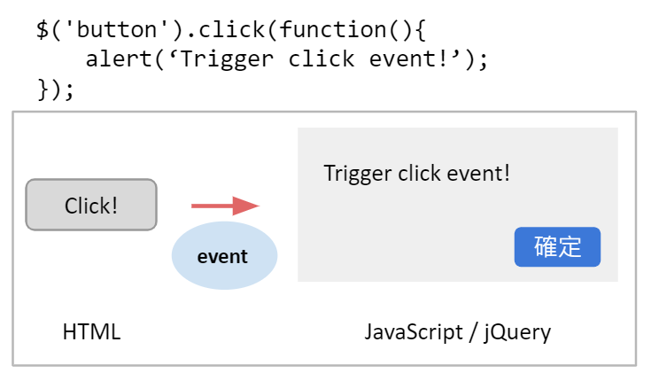

# Angular - 3 - Data Binding 2
## 雙向繫結 Two-way Data Binding
雙向繫結比較像是前一張提到的3種方法的結合，也可以說是 Angular 提供的一種語法糖。我們先嘗試用前面用到的 Data Binding 及 Event Binding 來做到雙向溝通。

```
|--app
  |--app.component.html
  |--server
    |--server.component.css
    |--server.component.html // 更改
    |--server.component.ts // 更改
```

1. `servers.component.html`
```html
<label>Server Name</label>
<input type="text" class="form-control" (input)="onUpdateServerName($event)">
<p>{{serverName}}</p>
<button class="btn btn-primary" [disabled]="!allowServer" (click)="onCreateServer()">Add Server</button>
<p>{{serverCreationStatus}}</p>
<app-server></app-server>
<app-server></app-server>
```
<br/>

2. `servers.component.ts`
```ts
export class ServersComponent implements OnInit {
    allowServer = false;
    serverCreationStatus = 'No server was created!';
    serverName = '';

    constructor() {
        setTimeout(() => {
            this.allowServer = true;
        }, 2000);
    }

    ngOnInit(): void {
    }

    onCreateServer() {
        this.serverCreationStatus = 'Server was created!';
    }

    onUpdateServerName(event: Event) {
        console.log(event); // 印出 event
        this.serverName = (event.target as HTMLInputElement).value; // as：轉型
    }
}
```

`(input)="onUpdateServerName($event)"` 會觸發 event，window 會製造事件透過 Event Binding 丟到綁定的 TypeScript 內的 function。

這邊就像是用 js 抓取 DOM 元素進行事件綁定，當使用者觸發事件後，window 會將事件拋出來，給 js 指定的 function 執行。


這邊的 `$event` 代表將事件相關的資訊傳到 method 內，不論丟過去的是不是 HTML Event，通常藉由事件帶過去的參數都會用 `$` 加 `event` 來做命名。

TypeScript 中 `onUpdateServerName()` 方法可以印出丟進來的 event 的屬性，input 中的 value 是在這個事件中的 event.target.value 屬性。另外，`(event.target as HTMLInputElement)` 是為了做轉型，因為不是每個 html Element 都有 value 屬性，所以要先告訴 Angular 它是 input Element。這樣就完成模擬類似 Two-Way-Binding 的效果，由 InputEvent 來把值帶到 TypeScript，再由 String Interpolation 把值重新渲染到 Template 上。

而在使用 Two-way Binding 之前需要先  import FormsModule 模組，因為等等會用到的 `[(ngModel)]` 原本目的是用來檢核表單內的值而設計的。


以上兩個例子可以看到 Event Binding 與 String Interpolation 並不是綁定到相同的元素上 ，使用 Two-way Binding 則可以綁定在同一個物件上就達到雙向溝通的效果。

> _✭參考：見底下連結_

```
|--app
    |--app.component.html
    |--app.module.ts //更動
    |--servers
        |--server.component.css
        |--server.component.html // 更改
        |--server.component.ts
```

1. `app.module.ts`
```ts
@NgModule({
    declarations: [
        AppComponent,
        ServerComponent,
        ServersComponent
    ],
    imports: [
        BrowserModule,
        FormsModule, // import
        AppRoutingModule
    ],
    providers: [],
    bootstrap: [AppComponent]
})
export class AppModule { }
```
<br/>

2. `servers.component.html`
```html
<label>Server Name</label>
<input type="text" class="form-control" (input)="onUpdateServerName($event)">
<input type="text" class="form-control" [(ngModel)]="serverName">
<p>{{serverName}}</p>
<button class="btn btn-primary" [disabled]="!allowServer" (click)="onCreateServer()">Add Server</button>
<p>{{serverCreationStatus}}</p>
<app-server></app-server>
<app-server></app-server>
```

3. `servers.component.ts`
```ts
export class ServersComponent implements OnInit {
    allowServer = false;
    serverCreationStatus = 'No server was created!';
    serverName = '';

    constructor() {
        setTimeout(() => {
            this.allowServer = true;
        }, 2000);
    }

    ngOnInit(): void {
    }

    onCreateServer() {
        this.serverCreationStatus = 'Server was created! Name is ' + this.serverName;
    }

    onUpdateServerName(event: Event) {
        // console.log(event);
        this.serverName = (event.target as HTMLInputElement).value;
    }
}
```

> 參考
* ✭：參考連結
[神的 github](https://github.com/JIA-WE-LIAN/Angular-LearningNote/blob/main/5.%20Binding.md)