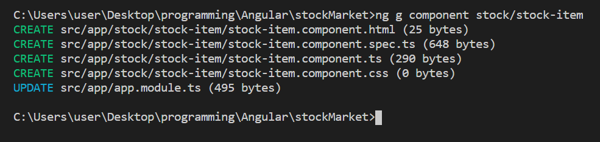

# Angular - 4 - Directive、範本參考變數
下面這張圖是參考 Udemy 上 Angular 課程的圖：


在 Angular 中只要提到 Directive，就是指寫在 Template 的指令，Directive 分成3種 ：
  1. 元件 ( Component )
  2. 屬性行指令 ( Attribute Directive )
  3. 結構型指令 ( Structural Directive )

## 元件 Component
前面用到的 Component 就是元件型指令，在 TypeScript 的 `@Component` 中的 selector 可以設定外部取用該元件的指令，讓 Template 可以抓到此 Component 並將其內容呈現出來。想要新增自訂元件可以在 Terminal 輸入`ng g component 元件名稱` 產生元件。

<br/>

## 屬性型指令 Attribute Directive
屬性型指令會監聽並改變家在元素上的行為、外觀、Attribute 或 Property。因為通常被應用在元件或是 Template 上，就像 HTML 屬性一樣，因此得名屬性型指令。

許多 Angular 內建的 Module（ ex：RouterModule、 FormsModule ) 都定義了自己的屬性型指令。最常見的內建屬性型指令如下：
* `NgClass`：新增和刪除一組 CSS 類別。
* `NgStyle`：新增和刪除一組 HTML 樣式。
* `NgModel`：將資料雙向繫結新增到 HTML 表單元素。
<br/>

## 結構型指令 Structural Directive
結構型指令會改變 HTML 的結構，可能回新增或是刪除某些 tag。結構型的指令不能夠同時使用在一個 Element 上 ( `*ngIf`、`*ngFor` on the same Element )，而 `*` 是 Angular 替結構型 Directive 多出的語法糖，例如 `*ngIf` 實際上是 `<ng-template>` 與 `[ngIf]` 的結合。常用的內建指令有：
  * `*ngIf`、`*ngFor`、`*ngSwitchDefult`、`*ngSwitchCase`
  * `ngSwitch`
<br/>

## `<ng-template>` 範本參考變數
範本參考變數是 Angular 內自定義的 Component，可視作一個等著被呼叫的區塊。`#` 代表此元素的 Reference，如果在 Template 中想抓到此元素，就必須使用 `#` 來標記它，稱呼上 `#` 會稱作 Template Reference Variable。類似於 HTML 中 tag 的 `id` 屬性概念，一個 Template 檔案中不能出現相同的範本參考變數，編譯器會報錯。

較常用的方法有2種：
* 直接在想參考到的物件上綁定範本參考變數
  ```html
  <input type="text" #inputValue>
  ```

* 或是宣告一個可以被參考的物件
  ```html
  <div #divEle="ngModel"></div>
  ```

當範本參考變數沒有賦值 ( 沒有等號 ) 時，取到的會是自己本身這個 HTML tag，若有等號才會是取到等號後面的元件屬性，例如 `ngModel`。通常與`ngTemplateOutlet`搭配使用。

```
|--app
    |--app.component.html
    |--app.module.ts 
    |--servers
        |--servers.component.css
        |--servers.component.html
        |--servers.component.ts
    |--server
        |--server.component.css
        |--server.component.html // 更改
        |--server.component.ts // 更改
```

1. `server.component.html`
```html
<button (click)="onClick(myParagraph)"> Show Template
<ng-template #myParagraph>
    <p>This is a paragraph.</p>
</ng-template>
```
<br/>

2. `server.component.ts`
```ts
export class ServerComponent implements OnInit {
  ngOnInit(): void {
  }

  onClick(myParagraph: any){
    console.log(myParagraph);
  }
}
```
我們嘗試把宣告成 `#myParagraph` 區塊的 Template 當成參數綁定到 click 事件，讓他被當作傳入參數丟到 TypeScript 並印出來看看


TypeScript 中拿到的會是一個 TemplateRef 物件，代表對那一個範本的參考。

## ngTemplateOutlet
* 用來放置 `<ng-template>`
* 可以把重複的樣板抽出
* 在同一 HTML 檔案中的任一 tag 內放置，顯示 `<ng-template>` 的內容：`<div *ngTemplateOutlet="自訂名稱">`
```html
<div *ngTemplateOutlet="data1"></div>
<div>中間有一百行</div>
<div *ngTemplateOutlet="data2"></div>
```
<br/>

