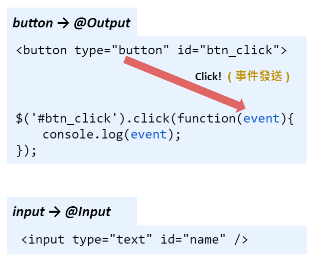

# Angular - 08 - `@Input`、`@Output`
到目前為止，元件的溝通方式都只有聚焦在 template 與 TypeScript 要怎麼互動，或是使用結構型指令 ( ex：`ngIf`、`ngFor` ) 來改變 template 的結構。如果出現了兩個同階層的元件要互相溝通，又或者是父子元件之間要進行溝通的話，我們該如何做呢?


這個章節會將關注點放在父子元件要如何溝通，下面有個練習，可以試著去切分看看 Component，以下將會以這個例子為範例。


按下 Add Server 按鈕，可以新增新的 Server 並顯示在下方；同理，按下 Add Server Blueprint 也會有同樣的效果。往下之前可以先嘗試看看怎麼去切分 Component 並賦予該有的邏輯。

* 範例 code 連結：[practice2]()
* 或是複製原本的 code 再進行拆分：
  1. `app.component.html`
  ```html
  <div class="container">
    <div class="row">
      <div class="col-xs-12">
        <p>Add new Servers or blueprints!</p>
        <label>Server Name</label>
        <input type="text" class="form-control" [(ngModel)]="newServerName">
        <label>Server Content</label>
        <input type="text" class="form-control" [(ngModel)]="newServerContent">
        <br>
        <button
          class="btn btn-primary"
          (click)="onAddServer()">Add Server</button>
        <button
          class="btn btn-primary"
          (click)="onAddBlueprint()">Add Server Blueprint</button>
      </div>
    </div>
    <hr>
    <div class="row">
      <div class="col-xs-12">
        <div
          class="panel panel-default"
          *ngFor="let element of serverElements">
          <div class="panel-heading">{{ element.name }}</div>
          <div class="panel-body">
            <p>
              <strong *ngIf="element.type === 'server'" style="color: red">{{ element.content }}</strong>
              <em *ngIf="element.type === 'blueprint'">{{ element.content }}</em>
            </p>
          </div>
        </div>
      </div>
    </div>
  </div>
  ```

<br/>

2. `app.component.ts`
  ```ts
  @Component({
  selector: 'app-root',
  templateUrl: './app.component.html',
  styleUrls: ['./app.component.css']
  })
  export class AppComponent {
    serverElements = [];
    newServerName = '';
    newServerContent = '';

    onAddServer() {
      this.serverElements.push({
        type: 'server',
        name: this.newServerName,
        content: this.newServerContent
      });
    }

    onAddBlueprint() {
      this.serverElements.push({
        type: 'blueprint',
        name: this.newServerName,
        content: this.newServerContent
      });
    }
  }
  ```

這裡會以下面的形式作拆分，所以需要先下 `ng g c cockpit`、`ng g c server-element` 建立兩個元件。


然後更改 App Module 的結構內容：
```
|--app
    |--app.component.html // 更動
    |--app.component.ts // 更動
    |--cockpit
    |--server-element
```

1. `app.component.html`
```html
<div class="container">
  <app-cockpit></app-cockpit>
  <hr>
  <div class="row">
    <div class="col-xs-12">
      <app-server-element></app-server-element>
    </div>
  </div>
</div>
```
<br/>

2. `app.component.ts`
```ts
export class AppComponent {
  serverElements = [];
}
```

拆分的過程一定會遇到我們一開始講的那個問題，也就是父子元件要怎麼做到溝通這件事。

## `@Input()`
當兩個子元件有共用變數時，通常我們會將這個變數放在父元件內，當子元件要取得父元件的變數時，需要在 TypeScript 中使用 `@Input` 這個 Directive。`@Input` 是 Angular 原生的一個功能，所以需要在 TypeScript 中 import。


在這個範例中，我們會把紀錄 server 資訊的物件 serverElements 放在 App Module，因為新增之後，我們要把資訊丟到 serverElements 內，元件 cockpit 需要取得 serverElements，我們會作如下的更改：
```
|--app
    |--app.component.html
    |--app.component.ts
    |--cockpit
        |--cockpit.component.html // 更動 
        |--cockpit.component.ts // 更動 
    |--server-elements
```

1. `cockpit.component.html`
```html
<div class="row">
  <div class="col-xs-12">
    <p>Add new Servers or blueprints!</p>
    <label>Server Name</label>
    <input type="text" class="form-control" [(ngModel)]="newServerName">
    <label>Server Content</label>
    <input type="text" class="form-control" [(ngModel)]="newServerContent">
    <br>
    <button
      class="btn btn-primary"
      (click)="onAddServer()">Add Server</button>
    <button
      class="btn btn-primary"
      (click)="onAddBlueprint()">Add Server Blueprint</button>
  </div>
</div>
```
<br/>

2. `cockpit.component.ts`
```ts
export class CockpitComponent implements OnInit {
  @Input() serverElements: {type: string, name: string, content: string}; // 取得父元件參數
  newServerName = '';
  newServerContent = '';

  constructor() { }

  ngOnInit() {
  }

  onAddServer() {
    this.serverElements.push({
      type: 'server',
      name: this.newServerName,
      content: this.newServerContent
    });
  }

  onAddBlueprint() {
    this.serverElements.push({
      type: 'blueprint',
      name: this.newServerName,
      content: this.newServerContent
    });
  }
}
```
使用外部物件時需要先在 TypeScript 中使用 `@Input` 宣告： `@Input() serverElements { type: string, name: string, content: string };`，大括號內是指定該物件內容型別，物件型別是根據父元件定義的屬性。宣告玩就可以拿到放在 App Module 的參數，並在自己的邏輯曾使用。所有自定義的 Component 想要吃到外部父元件的參數值，就必須使用 `@Input()`。

同理，server-element Component 也可以這樣調整：
```
|--app
    |--app.component.html // 更動
    |--app.component.ts
    |--cockpit
        |--cockpit.component.html  
        |--cockpit.component.ts 
    |--server-elements
      |--servler-element.component.html // 更動
      |--servler-element.component.ts // 更動
```

1. `app.component.html`
```html
<div class="container">
  <app-cockpit></app-cockpit>
  <hr>
  <div class="row">
    <div class="col-xs-12">
      <app-server-element
        *ngFor="let serverElement of serverElements"></app-server-element>
    </div>
  </div>
</div>
```
這裡會在 <app-server-element> 加上一個 Property Binding 的語法，將 `*ngFor` 的中的 serverElement 綁定到 server-element Component 中的共用物件 serverElementes 內的內容 ( element ) 。另外，如果想要更改 Component 的 property 名稱，可以在 `@Input()` 的小括號內加上別名：
```ts
@Input('svcElement') -> <app-server-element [svcElement]="serverElement"></app-server-element>
```
<br/>

2. `server-element.component.html`
```html
<div
  class="panel panel-default">
  <div class="panel-heading">{{ element.name }}</div>
  <div class="panel-body">
    <p>
      <strong *ngIf="element.type === 'server'" style="color: red">{{ element.content }}</strong>
      <em *ngIf="element.type === 'blueprint'">{{ element.content }}</em>
    </p>
  </div>
</div>
```
<br/>

3. `server-element.component.ts`
```ts
export class ServerElementComponent implements OnInit {
  @Input()element: {type: string, name: string, content: string};

  constructor() { }

  ngOnInit() {
  }
}
```

p.s. 要監視`@Input()`屬性的更改，可觀察`OnChanges`生命週期。

---

## @Output()
在沒有使用前端框架，最常遇到比較經典類似 `@Input()` 操作的動作就是在 input 欄位上輸入，而 `@Output` 則像是點擊一個 button 之後，瀏覽器會幫我們產生一個事件發送出去，然後被我們註冊的 function 接住並執行我們想做的事情，只是一般不會對接收到的 event 操作 ( 如果是為了防止冒泡事件，你可能就會用到 `event.target` 之類的 )。


上面更新完 serverElements 物件之後，應該將最新的內容也更新到 App Module 內，由子元件向父元件溝通，這時候就可以使用 `@Output()`。`@Output()` 本身的功能就是用來定義 Component 內輸出的屬性，用途是將子元件的值傳給父元件，通常會搭配 EventEmitter ( 事件發射器 ) 使用，在 TypeScript 中 new 一個事件後將事件發射 ( emit，事件發射等同於觸發該事件 )。

```
|--app
    |--app.component.html // 更動 
    |--app.component.ts // 更動 
    |--cockpit
        |--cockpit.component.html
        |--cockpit.component.ts // 更動 
    |--server-elements
```

1. `cockpit.component.ts` ???
```ts
export class CockpitComponent implements OnInit {
  @Output() serverCreated = new EventEmitter<{serverName: string, serverContent: string}>();
  @Output() blueprintCreated = new EventEmitter<{serverName: string, serverContent: string}>();
  newServerName = '';
  newServerContent = '';

  constructor() { }

  ngOnInit() {
  }

  onAddServer() {
    this.serverCreated.emit({ // 事件發射
      serverName: this.newServerName,
      serverContent: this.newServerContent
    });
  }

  onAddBlueprint() {
    this.blueprintCreated.emit({
      serverName: this.newServerName,
      serverContent: this.newServerContent
    });
  }
}
```
在 cockpit Component 的 TypeScript 中註冊了兩個事件發射器 `serverCreated` 與 `blueprintCreated`，註冊方法是 `new EventEmitter<>()`，在 `<>` 可以定義被事件發送出去的物件格式。當使用者觸發 Template 按鈕後，ts 檔的 `onAddServer()` 方法會被執行，然後呼叫 `emit()` 方法將事件發送出去，方法內傳入要被發送出去的物件內容。`@Output()` 中的 `()` 其實跟 `@Input()` 的作用相同，可更改對於外部 Component 所看到的事件名稱。
<br/>

2. `app.component.html`
```html
<div class="container">
  <app-cockpit
    (serverCreated)="onServerAdded($event)"
    (blueprintCreated)="onBlueprintAdded($event)"></app-cockpit>
  <hr>
  <div class="row">
    <div class="col-xs-12">
      <app-server-element
        *ngFor="let serverElement of serverElements"
        [element]="serverElement"></app-server-element>
    </div>
  </div>
</div>
```
AppComponent 的 Template 變動主要是在 `<app-cockpit></app-cockpit>` 上綁定兩個 Event：`serverCreated` 跟 `blueprintCreated`。前面提到過事件被發射 (emit) 出來等同於被觸發，在 cockpit Component 事件發送，對 App Component 來說等於事件被觸發，所以在 Template 上綁定的事件要跟子元件註冊的事件名稱一樣，傳入事件的參數依照慣例會命名為 `$event` ( 不管它的型別是不是真的是 Event，就只是為了代表是觸發事件傳進去的參數而已 )。

<br/>

3. `app.component.ts`
```ts
export class AppComponent {
  serverElements = [{type: 'server', name: 'TestServer', content: 'Just a test!'}];

  onServerAdded(serverData: {serverName: string, serverContent: string}) {
    this.serverElements.push({
      type: 'server',
      name: serverData.serverName,
      content: serverData.serverContent
    });
  }

  onBlueprintAdded(blueprintData: {serverName: string, serverContent: string}) {
    this.serverElements.push({
      type: 'blueprint',
      name: blueprintData.serverName,
      content: blueprintData.serverContent
    });
  }
}
```
由於透過事件傳進來的變數是一個物件，在宣告傳入變數時需要依照子元件定義要丟出的物件行別來宣告，這樣就完成讓父元件接收到子元件丟出的參數值。
<br/>

---

## EventEmitter
用在帶有 `@Output` 指令的元件中，以同步或非同步方式發出自訂事件，並透過訂閱實例來為這些事件註冊處理器。有一些方法可以使用，例如 `emit()` 或是 `subscribe()`。

詳見官方 API：https://angular.tw/api/core/EventEmitter

> 參考
* Udemy 課程
* [神的 github](https://github.com/JIA-WE-LIAN/Angular-LearningNote/blob/main/5.%20Binding.md)


