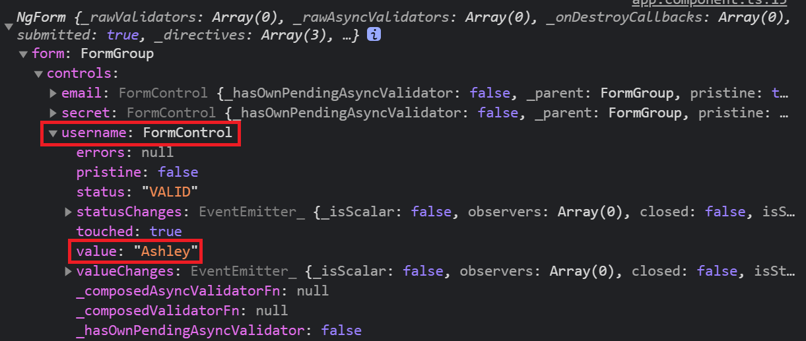

# Angular - 15 - Template-driven Form
在表單處理的部分，Angular 提供了兩種不同的方法：Template-driven Form 和 Reactive Form。兩者都從 View 中捕獲使用者輸入事件、驗證使用者輸入、建立表單模型、修改資料模型，並提供追蹤這些更改的途徑。

比起原生的 Form 表單，Angular 提供的 Form 多了一層封裝，按下按鈕提交表單後會有一組以 JSON 格式紀錄 input 等 tag 的值、以及檢核狀態等等的資料送到後端。因為有這層封裝，不會有預設的 Form 表單的行為 ( 按下 Form 表單中的 `<button>` 不會出現導頁或重新整理的行為 )。


> _✭參考：見底下連結_

## Template-driven Form 範本驅動表單
Template-driven Form 顧名思義就是將檢核邏輯寫在 Template 上，依賴寫在 Template 中的指令來建立和操作底層的物件模型，適合用在欄位及邏輯簡單的表單，邏輯複雜時會較不易維護與擴充。

響應式表單和範本驅動型表單都會追蹤使用者與之互動的表單輸入元素和元件模型中的表單資料之間的值變更。這兩種方法共享同一套底層建構塊，只在如何建立和管理常用表單控制元件實例方面有所不同。

要使用 Tempalte-driven Form，要先在 `app.module.ts` 中 import FormsModule。

```ts
@NgModule({
  declarations: [
    AppComponent
  ],
  imports: [
    BrowserModule,
    FormsModule
  ],
  providers: [],
  bootstrap: [AppComponent]
})
```

```
|--app
    |--app.component.html // 更改
    |--app.module.ts // 更改
    |--servers
    |--server
```

1. `app.module.html`
```html
<div class="container">
  <div class="row">
    <div class="col-xs-12 col-sm-10 col-md-8 col-sm-offset-1 col-md-offset-2">
      <form (ngSubmit)="onSubmit(form)" #form="ngForm">
        <div id="user-data">
          <div class="form-group">
            <label for="username">Username</label>
            <input type="text"
                    id="username"
                    class="form-control"
                    name="username"
                    ngModel>
          </div>
          <button class="btn btn-default" type="button">Suggest an Username</button>
          <div class="form-group">
            <label for="email">Mail</label>
            <input type="email"
                    id="email"
                    class="form-control"
                    name="email"
                    ngModel>
          </div>
        </div>
        <div class="form-group">
          <label for="secret">Secret Questions</label>
          <select id="secret"
                  class="form-control"
                  name="secret"
                  ngModel>
            <option value="pet">Your first Pet?</option>
            <option value="teacher">Your first teacher?</option>
          </select>
        </div>
        <button class="btn btn-primary" type="submit">Submit</button>
      </form>
    </div>
  </div>
</div>
```
Template-driven Form 是使用像下面這張圖的階層來管理表單實例，最外層的 `<form>` 需要寫下 `ngForm` 來管理整個表單，並且使用範本參考變數將 `ngForm` 帶到 TypeScript 中，使用 `console.log()` 進行觀察。對於每個想要監控的欄位如 `<input>`，則需要加上 `ngModel` Directive。


`<input>` 欄位的 `name` 屬性也不可以被省略，雖然在原生表單中要讓使用者輸入值就必須帶有 `name` 屬性，不過在 Angular 中，`ngForm` 也會以 `name` 屬性作為綁定的 `value` 的 `key` 值。

另外值得一提的是，在 `<form>` 有綁定 Angular 自己的 submit 事件，為什麼不是綁定在 `<button>` 上，原因跟上面提到的一樣，Angular 對 Form 有多一層封裝，所以也有相對應的 `ngSubmit` 事件可以直接使用。
<br/>

2. `app.module.ts`
```ts
export class AppComponent {
  suggestUserName() {
    const suggestedName = 'Superuser';
  }

  onSubmit(form: NgForm) {
    console.log(form);
    console.log('submitted!');
  }
}
```
前面有提到 `name` 屬性會被當作是 `key` 值，那是怎麼樣的架構呢?我們在 `<form>` 表單上使用範本參考變數將 `ngForm` 丟到邏輯層印出來觀察，打開開發者工具並按下提交按鈕後，可以看到出現了這個物件：


點開 `form` 下面 `controls` 屬性，可以看到有一組類似物件格式的資料內容，分別有3個不同的 key 值： email、secret 跟 username。這三個東西的內容是 FormControl 物件，展開 username 後可以發現有 `value` 屬性紀錄剛剛輸入的使用者名稱，還有另外一些狀態，例如：`pristine`、`valid`、`errors` 等等。


## 使用 `ngModel` 進行綁定
回頭來看一前面章節的 Template 有使用 `ngModel` 來做到**雙向繫結**，這只是其中一種用法，`ngModel` 的主要是用在表單驗證功能。一般我們在使用 `ngModel` 綁定 Template value 到 TypeScript 時會有幾種較常用的模式：

1. 直接在要檢核的欄位上加上 `ngModel`，只要綁定 `ngModel` 就會有檢核效果
```html
<form #form="ngForm">
  <input type="text" 
  name="account"
  ngModel>
</form>
```

2. 讓範本參考變數指向 `ngModel` 物件，但不會有檢核效果，需要另外在 tag 上直接寫下 `ngModel` 才有用。
```html
<form #form="ngForm">
  <input type="text" 
    name="account" 
    #account="ngModel">
</form>
```
<br/> 

3. 在 Templage 上使用 Property Binding，可以在 TypeScript 設定預設值，Angular 會將這個值當作是預設值，有檢核。
```html
<form #form="ngForm">
    <input type="text" 
      name="account" 
      [ngModel]="defaultInput">
</form>
```
```ts
export class AppComponent {
  defaultInput = '我是預設值'
}
```
<br/>

4. 利用 Two-way Binding 綁定範本參考變數，同時將值代到後端。這種綁法會在該欄位上有檢核。
```html
<form #form="ngForm">
  <input type="text" 
    name="account"
    [(ngModel)]="account" 
    #account>
</form>
```
  <br/>

可以觀察看看下面範例在使用 `ngModel` 綁定上有沒有什麼差別。
```
|--app
    |--app.component.html // 更改
    |--app.module.ts // 更改
    |--servers
    |--server
```

1. `app.component.html`
```html
<div class="container">
  <div class="row">
    <div class="col-xs-12 col-sm-10 col-md-8 col-sm-offset-1 col-md-offset-2">
      <form (ngSubmit)="onSubmit()" #form="ngForm">
        <div id="user-data">
          <div class="form-group">
            <label for="username">Username</label>
            <input type="text"
                    id="username"
                    class="form-control"
                    name="username"
                    ngModel
                    required>
          </div>
          <button class="btn btn-default" type="button">Suggest an Username</button>
          <div class="form-group">
            <label for="email">Mail</label>
            <input type="email"
                    id="email"
                    class="form-control"
                    name="email"
                    ngModel
                    required
                    email
                    #email="ngModel">
            <span class="help-block" *ngIf="email.invalid && email.touched">Please enter a valid email!</span>
          </div>
        </div>
        <div class="form-group">
          <label for="secret">Secret Questions</label>
          <select id="secret"
                  class="form-control"
                  name="secret"
                  [ngModel]="defaultQuestion">
            <option value="pet">Your first Pet?</option>
            <option value="teacher">Your first teacher?</option>
          </select>
        </div>
        <div class="form-group">
          <textarea name="testTextarea"
                    rows="3"
                    class="form-control"
                    [(ngModel)]="answer">
          </textarea>
        </div>
        <p>Your reply:{{answer}}</p>
        <button class="btn btn-primary" type="submit" [disabled]="form.invalid">Submit</button>
      </form>
    </div>
  </div>
</div>
```
這邊分別有4種綁定方式，第一種在 `<input>` 直接寫下 `ngModel` 綁定，另一個則是用範本參考變數綁定，要檢核的話就要像 email 欄位一樣，在 tag 上寫下 `ngModel`；在 `<select>` 欄位上用 `[ngModel]`，最後在 `<textarea>` 中使用 `[(ngModel)]` 的雙向綁定。
<br/>

2. `app.component.ts`
```ts
export class AppComponent {
  @ViewChild('form', {static: false}) signupForm: NgForm;
  defaultQuestion = 'teacher';
  answer = 'answer';

  suggestUserName() {
    const suggestedName = 'Superuser';
  }

  onSubmit() {
    console.log(this.signupForm);
  }
}
```

> 參考
* ✭：參考連結
[神的 github](https://github.com/we-jia/Angular-LearningNote/blob/main/10.%20Template-Driven%20Form.md)
* [Angular 表單簡介](https://angular.tw/guide/forms-overview)