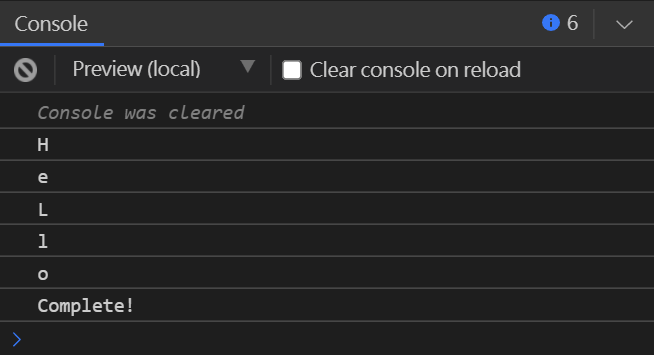

# Angular - 29 - Observable with Operator - 1
## Operator (續)
#### skip()
可以略過前幾個指定數量的元素。不過要記得如果想要略過前3個元素取第4個，仍需要花3秒的時間。

```
|--main
  |--main.component.html
  |--main.component.ts // 更改
```

1. `main.component.ts`
```ts
export class AppComponent implements OnInit {

  ngOnInit(): void {
    console.clear();

    interval(1000)
      .pipe(skip(3))
      .subscribe(data => console.log(data));
  }
}
```

---

接下來的幾個 Operators 則像是 AND ( && ) 邏輯，多個元素送進來，最後只會輸出一個元素，但各自行為上仍有些差異。
<br/>

#### concat() / concatWith()
可以將多個 Observable 實例合併成一個。第8版之後的 Rxjs 已經將 `concat()` 方法移除，改用 `concatWith()`。兩者方法使用上的差異如下：
```
concat(source1, source2, source3) ===等同於===> source1.pipe(concatWith(source2, source3))
```

`concatWith()` 內可以傳入一個陣列，陣列內的型別是 `any`，API 資訊如下。
```ts
concat<T, R>(...args: any[]): OperatorFunction<T, R>
```

使用 `concat()` 或 `concatWith()` 他就會幫我們把所有元素合併起來。下面的例子中有兩個 data source，第一個 data source 稍微複雜了一點，是一個陣列裡面含有物件或純值。接下來用 `interval` 搭配 `take(3)` 來測試，表示拿到3筆之後就要合併另外兩個 data source 的資料。
```
|--main
  |--main.component.html
  |--main.component.ts // 更改
```

1. `main.component.ts`
```ts
export class AppComponent implements OnInit {
  observavle: any;

  ngOnInit(): void {
    console.clear();

    let source1 = of([
      {
        map1: "map1"
      },
      "map2",
      ["map3", "map4"]
    ]);

    let source2 = of(4, 5, 6);

    this.observavle = interval(1000)
      .pipe(
        take(3),
        concat(source1, source2)
      )
      .subscribe(console.log);
  }

  ngOnDestroy() {
    this.observavle.unsubscribe();
  }
}
```
傳入的兩個 data source 的資料要等第一個 Observable 完成  ( complete ) 才會被執行，結果如下：

<br/>

#### concatAll()
可以將二維以上的陣列 ( 含二維陣列 ) 攤平成一維陣列，可以想像成把陣列內的所有元素 concat 起來，不管裡面有幾層。
```
|--main
  |--main.component.html
  |--main.component.ts // 更改
```

1. `main.component.ts`
```ts
export class AppComponent implements OnInit {

  ngOnInit(): void {
     let dataSource = [
        ['cat', 'dog', 'bird', 'turtle'],
        ['elephant', 'hippo', 'zebra']
     ];

    from(dataSource)
      .pipe(concatAll())
      .subscribe(console.log);
  }
}
```
上面這個例子我們設計了一個二維陣列，當我們使用 `concatAll()` 後把結果印出來會發現他已經將陣列內的所有值拆開，並放在同一個陣列內，所以 console 印出來的結果會是一個一個的字串內容。
<br/>


如果改為使用 `map()` 的話結果就會不一樣，經過 `map()` 拿到的會是裡面內層的陣列。要注意的是，`concatAll()` 會處理 source 先發出來的 Observable，必須等到這個 Observable 結束，才會再處理下一個 source 發出來的 Observable。
```
|--main
  |--main.component.html
  |--main.component.ts // 更改
```

1. `main.component.ts`
```ts
export class AppComponent implements OnInit {

  ngOnInit(): void {
     let dataSource = [
        ['cat', 'dog', 'bird', 'turtle'],
        ['elephant', 'hippo', 'zebra']
     ];

    from(dataSource)
       .pipe(map(x => x))
       .subscribe(console.log);
  }
}
```


整體來說感覺會像是這樣的結構：

<br/>

#### mergeWith()
雖然 `mergeWith()` 跟 `concat()` 都是用來合併，但行為上有很大的不同。首先先看 `mergeWith()` 內也是要傳入一個陣列，API 資訊如下：
```ts
mergeWith<T, A extends readonly unknown[]>(...otherSources: any[]): OperatorFunction<T, T | A[number]>
```
再來我們將 source1 跟 source2 改為有順序的數字，看印出來的順序。

```
|--main
  |--main.component.html
  |--main.component.ts // 更改
```

1. `main.component.ts`

```ts
export class AppComponent extends ngOnInit {
  observavle: any;

  ngOnInit(): void {
    console.clear();
    let source1 = interval(1000).pipe(take(5));
    let source2 = interval(500).pipe(take(3));

    source2.pipe(
      mergeWith(source1)
    )
    .subscribe(
      data => console.log(data),
      error => console.log(error),
      () => console.log("Complete!")
    );
  }
}
```
從 console 可以看的出來，`mergeWith()` 是把多個 Observable 同時處理 ( 並行處理 ) 跟前面提到的 `concat()` / `concatWith()` 一次只處理一個 Observable 完全不一樣，`mergeWith()` 所有併發的資料會穿插在 Observable Stream。而當所有資料都被處理結束後，Observable 才會真正地完成。<br/>

 <br/>

<br/>

#### combineLatest() *(deprecated)*
可以將多個 Observable 的最後一筆資料取出並合併成一個 Observable 後送出。
```
|--main
  |--main.component.html
  |--main.component.ts // 更改
```

1. `main.component.ts`
```ts
export class AppComponent implements OnInit {

  ngOnInit(): void {
    let source1 = interval(1000).pipe(take(3));
    let source2 = interval(500).pipe(take(5));

    source2.pipe(
      combineLatest(source1, (x, y) => x + y)
    )
    .subscribe(
      data => console.log(data),
      error => console.log(error),
      () => console.log("Complete!")
    );
  }
}
```

<br/>

#### zip()
將多個 Observable 相同順位的元素傳入 callback 做操作，最終回傳一個 Observable。可以用在當發送不同 API 但是想要同時接收到資料的情況，所有資料回傳了之後 `zip()` 才會開始運作。但因為 `zip()` 會 cache 住還沒處理的元素，當資料較多或兩個 Observable 時間差較大的話，很有可能造成記憶體相關的問題。

```
|--main
  |--main.component.html
  |--main.component.ts // 更改
```

1. `main.component.ts`
```ts
export class AppComponent implements OnInit {

  ngOnInit(): void {
    let source1 = interval(1000).pipe(take(3));
    let source2 = interval(500).pipe(take(5));

    source2.pipe(
      zip(source1, (x, y) => x + y)
    )
    .subscribe(
      data => console.log(data),
      error => console.log(error),
      () => console.log("Complete!")
    );
  }
}
```

<br/>

#### withLatestFrom()
運作方式跟 `combineLatest()` 有點像，只是只有在主要的 Observable 送出新的值才會進行新一輪的處理，以下面的例子來說，主要的 Observable 是 source1。而當作傳入參數的 Observable ( source2 ) 則是在背景運作。
```
|--main
  |--main.component.html
  |--main.component.ts // 更改
```

1. `main.component.ts`
```ts
export class AppComponent implements OnInit {

  ngOnInit(): void {
    let source1 = interval(1000).pipe(take(3));
    let source2 = interval(500).pipe(take(5));

    source2.pipe(
      zip(source1, (x, y) => x + y)
    )
    .subscribe(
      data => console.log(data),
      error => console.log(error),
      () => console.log("Complete!")
    );
  }
}
```
印出的結果如下：<br/>

<br/>

## 小結
* skip
* concat / concatWith
  * 等第一個 Observable 做完才會做後續的
* concatAll
  * 將所有二維以上陣列攤平成一維陣列
* mergeWith
  * 同時將所有 Observable 發出去，並回傳收集所有資料的 Observable
* combineLatest
  * 取每個 Observable 的最新一筆資料做操作，只回傳一個 Observable
* zip
  * 將不同 Observable 相同順位的元素取出操作，只回傳一個 Observable
* withLatestFrom

> 參考
* https://blog.jerry-hong.com/series/rxjs/thirty-days-RxJS-09/

* https://rxjs-dev.firebaseapp.com/api
